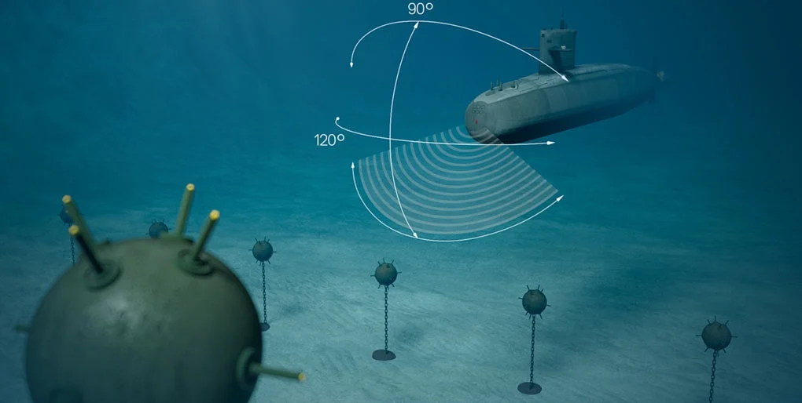

# Project-1-ML-for-Sonar

Utilize logistic regression model from the Scki-Learn library to create a prediction system for identifying and distinguishing between rock and mine for a submarine in the sea. 

We will be using preprocessing tools to help better prepare the data in order to gain the best result for machine learning. 

Enjoy